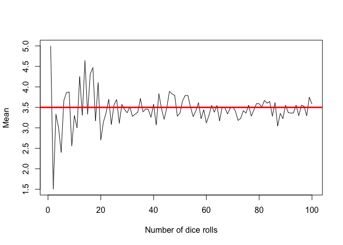
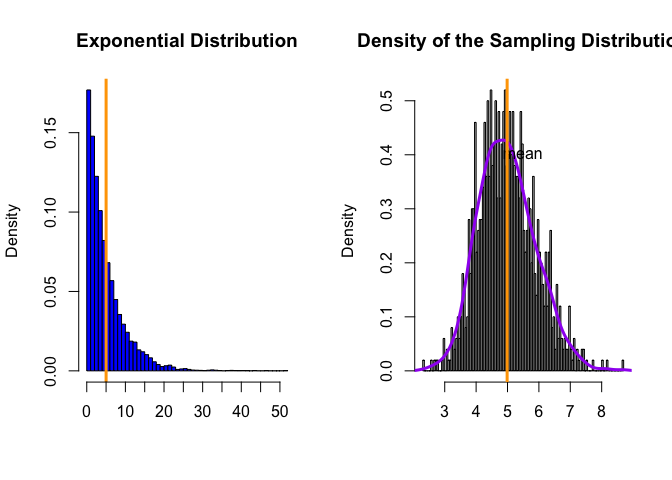

Law of Large Numbers and the Central Limit Theory
================
Constanza F. Schibber
September 15, 2018

# Law of Large Numbers

The Law of Large Numbers (LLN) states that the sample mean converges to
the distribution mean as the sample size increases. Formally, as sample
size $n$ increases, the mean of the sample $\bar{X}$ will approach the
mean of the distribution $\mu$.

In the following function, I simulate the LLN. The function inputs are
$n$, the size of the sample, and the $event$ that we considering. In the
second line of the function, we have two R functions:
Take i.i.d. samples (R function \`\`sample”) of size $n$ from a set of
$events$ (input event is specified by us)

``` r
set.seed(89034)

LLN.sim = function(n, event){mean(sample(event, size=n, replace=TRUE))}
```

## Simulate a fair coin flip

Let’s simulate the flip of a fair coin. We record heads as $1$ and tails
as $0$. The mean $\mu$ of the distribution will be $0.5$. We create a
list of events called coin.flip in which we have $0$ for T and $1$ for
H.

``` r
coin.flip<-0:1
coin.flip
```

    ## [1] 0 1

Then we set the size of our sample $n$. You can change $n$ in order to
see how fast/slow $\bar{X}$ converges to $\mu$.

``` r
n<-100
```

$n$ and coin.flip will be the inputs for our LLN function.

Now we want apply our function and also make a figure summarizing our
results.

The following code combines these two steps:

``` r
plot(sapply(1:n, event=coin.flip, FUN=LLN.sim), type="l", xlab="Number of Coin Flips", ylab="Mean")
abline(h=0.5, col="red", lwd=3)
```

<!-- -->

## Simulate the roll of a fair die

We can do the same exercise, but considering the roll of a fair die. The
only change in the code will be the input of our function: $event$ and
$n$. Here, the $event$ will be the roll of a die so we can roll 1, 2, 3,
4, 5, 6. In the code bellow, I create the object die which is a list
with values 1 through 6.

The mean of the distribution of die rolls $\mu$ is $3.5$.

Again, you can change $n$ to see changes in covergence.

``` r
die<-1:6
n<-100
```

Below we apply the function and plot the results.

``` r
plot(sapply(1:n, event=die, LLN.sim), type="l", xlab="Number of dice rolls", ylab="Mean")
abline(h=3.5, col="red", lwd=3)
```

<!-- -->

# Central Limit Theorem

The Central Limit Theorem states that as $n$ increases, the distribution
of $\bar{X}_n$ (a.k.a. sampling distribution) approaches that of a
normal distribution with mean $\mu$ (population mean) and variance
$\sigma^2/n$ (population variance divided by $n$).

We will take samples of size $n=30$ from a exponential distribution with
$\lambda=0.2$. You can change these two variables if you want. In the
central limit theorem (CLT), the size of each sample $n$ is fixed so
that is why we establish this before hand.

``` r
lambda=0.2
n<-30
```

To simulate the CLT we want to do the following:
``` r
N=1000
vector.of.means<- NULL
for(i in 1:N){
    vector.of.means<-c(vector.of.means, mean(rexp(n, lambda)))
}
```

Here we can see a summary of the means.

``` r
summary(vector.of.means)
```

    ##    Min. 1st Qu.  Median    Mean 3rd Qu.    Max. 
    ##   2.344   4.352   4.921   4.988   5.555   8.680

``` r
var(vector.of.means)
```

    ## [1] 0.8220541

I can also inspect the population distribution, the exponential
distribution with lambda 0.2. I take a large sample.The mean of the
distribution $\mu$ is $\frac{1}{\lambda}$ which is $\frac{1}{0.2}=5$
(corroborated by R)

``` r
large.N=10000
exp.dist<-rexp(large.N, lambda)

summary(exp.dist)
```

    ##     Min.  1st Qu.   Median     Mean  3rd Qu.     Max. 
    ##  0.00012  1.48600  3.50119  5.00816  6.89621 51.91550

``` r
mean(exp.dist)
```

    ## [1] 5.008157

``` r
var(exp.dist)
```

    ## [1] 25.07944

We can now plot side by side the population distribution (exponential
distribution) and the sampling distribution (vector.of.means). We can
calculate the mean of both distributions and compare.

``` r
par(mfrow=c(1,2))
# Plot 1
hist(exp.dist, col='blue', breaks=70, main='Exponential Distribution', freq=FALSE,xaxt="n", xlab="")
abline(v=mean(exp.dist), lwd=3, col='orange')
text(mean(exp.dist)+.5, .4, "mean")
axis(1, at=seq(from=0,to=max(exp.dist),by=5), labels=seq(from=0, to= max(exp.dist),by=5) )
# Plot 2
hist(vector.of.means, main="Density of the Sampling Distribution", breaks=100, xlab="", col="gray",freq=FALSE)
lines(density(vector.of.means), col="purple", lwd=3)
text(mean(vector.of.means)+0.5, .4, "mean")
abline(v=mean(vector.of.means), lwd=3, col='orange')
```

<!-- -->

We observe that in both cases, the mean is $5$. You can also see that
the variance of the sampling distribution is close to $\sigma^2/n$, as
stated by the CLT. We can put this to the test:

``` r
n #sample size
```

    ## [1] 30

``` r
var(exp.dist) #sigma^2
```

    ## [1] 25.07944

``` r
var(vector.of.means) #sigma^2/n
```

    ## [1] 0.8220541

``` r
var(exp.dist)/n #sigma^2/n
```

    ## [1] 0.8359813
