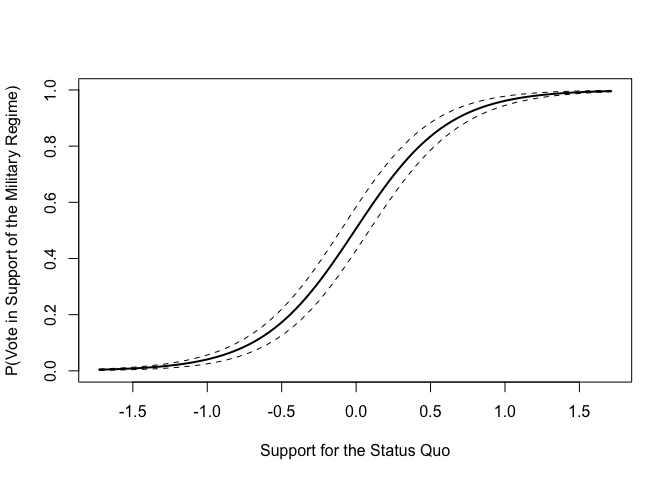
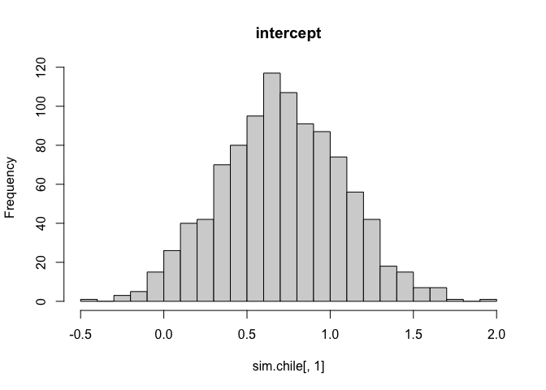
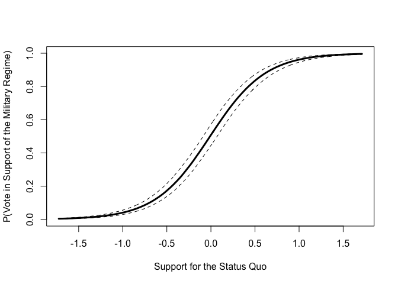
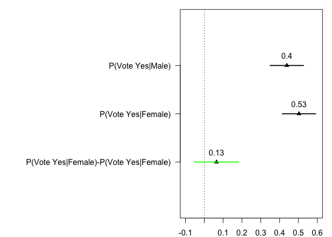
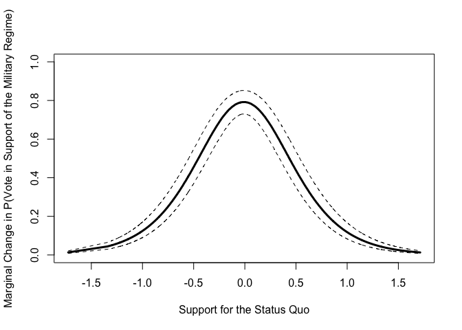
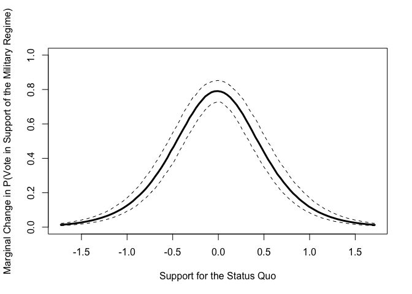

Binomial Outcomes
================
Constanza F. Schibber
2017-03-07

- [1 Data: Voting Intentions in the 1988 Chilean
  Plebiscite](#1-data-voting-intentions-in-the-1988-chilean-plebiscite)
- [2 Fitting Logit Model](#2-fitting-logit-model)
- [3 Likelihood Ratio Test](#3-likelihood-ratio-test)
  - [3.1 Null v Specified Model](#31-null-v-specified-model)
  - [3.2 Saturated v Specified Model](#32-saturated-v-specified-model)
- [4 How well does our model predict the data? Error
  rate](#4-how-well-does-our-model-predict-the-data-error-rate)
- [5 Odds Ratio](#5-odds-ratio)
  - [5.1 Odds Ratio for Status Quo
    covariate](#51-odds-ratio-for-status-quo-covariate)
  - [5.2 Odds Ratio, Sex](#52-odds-ratio-sex)
  - [5.3 Odds ratio, Education](#53-odds-ratio-education)
- [6 Predicted Probablities](#6-predicted-probablities)
  - [6.1 Plotting predicted probabilities for different values of Status
    Quo (low tech
    version)](#61-plotting-predicted-probabilities-for-different-values-of-status-quo-low-tech-version)
  - [6.2 Plotting predicted probabilities for different values of Status
    Quo (Monte Carlo
    simulation)](#62-plotting-predicted-probabilities-for-different-values-of-status-quo-monte-carlo-simulation)
- [7 First Differences: Plotting predicted probabilities for men and
  women, and first difference (Monte Carlo
  simulation)](#7-first-differences-plotting-predicted-probabilities-for-men-and-women-and-first-difference-monte-carlo-simulation)
- [8 Marginal Change in Probability](#8-marginal-change-in-probability)
  - [8.1 Marginal Change in Probability, Status
    Quo](#81-marginal-change-in-probability-status-quo)
- [9 Marginal Change in Probability (for
  Income)](#9-marginal-change-in-probability-for-income)
- [10 Plotting using `curve` instead of
  `lines`](#10-plotting-using-curve-instead-of-lines)
- [11 Multinomial Logit](#11-multinomial-logit)
  - [11.1 `mlogit` package](#111-mlogit-package)

# 1 Data: Voting Intentions in the 1988 Chilean Plebiscite

The Chile data frame has 2700 rows and 8 columns. The data are from a
national survey conducted in April and May of 1988 by FLACSO/Chile.
There are some missing data.

The survey wanted to capture Chileans attitudes and whether they would
vote in favor/against the authoritarian regime during the Chilean
plebiscite/referendum. In this referendum, all citizens would vote on
whether Chile would continue as a military regime or it would transition
to open and free elections towards democracy.

``` r
library(car)
```

    ## Loading required package: carData

``` r
#help(Chile) # for more information on the dataset
summary(Chile)
```

    ##  region     population     sex           age        education  
    ##  C :600   Min.   :  3750   F:1379   Min.   :18.00   P   :1107  
    ##  M :100   1st Qu.: 25000   M:1321   1st Qu.:26.00   PS  : 462  
    ##  N :322   Median :175000            Median :36.00   S   :1120  
    ##  S :718   Mean   :152222            Mean   :38.55   NA's:  11  
    ##  SA:960   3rd Qu.:250000            3rd Qu.:49.00              
    ##           Max.   :250000            Max.   :70.00              
    ##                                     NA's   :1                  
    ##      income         statusquo          vote    
    ##  Min.   :  2500   Min.   :-1.80301   A   :187  
    ##  1st Qu.:  7500   1st Qu.:-1.00223   N   :889  
    ##  Median : 15000   Median :-0.04558   U   :588  
    ##  Mean   : 33876   Mean   : 0.00000   Y   :868  
    ##  3rd Qu.: 35000   3rd Qu.: 0.96857   NA's:168  
    ##  Max.   :200000   Max.   : 2.04859             
    ##  NA's   :98       NA's   :17

``` r
# Recode yes/no 
# We recode "undecided" and "abstain" as NA
Chile$yes <- with(Chile, ifelse(vote == "Y", 1, ifelse(vote=="N", 0, NA))) 
table(Chile$vote)
```

    ## 
    ##   A   N   U   Y 
    ## 187 889 588 868

``` r
table(Chile$yes)
```

    ## 
    ##   0   1 
    ## 889 868

Then omit observations with missing data - Issue is that if you don’t
omit missing the predicted values will have a different length than the
data and it can cause problems. *We will cover in a few weeks how to
handle missing values using multiple imputation.* Do not omit missing
data when you conduct your own research work! Missing data can be (and
most times is) a source of bias.

``` r
Chile<-na.omit(Chile)
```

# 2 Fitting Logit Model

The outcome variable is `vote`. Yes, which is code 1, means voting in
favor of the authoritarian regime (Pinochet) and no, coded 0, voting
against the authoritarian regime.

The covariates:

- status quo: Scale of support for the status-quo.
- age in years.
- income: Monthly income, in Pesos.
- education: A factor with levels (note: out of order): P, Primary; PS,
  Post-secondary; S, Secondary.

``` r
Chile.out <- glm(yes ~ statusquo+age+income+education, family=binomial(link=logit), data=Chile) 

summary(Chile.out)
```

    ## 
    ## Call:
    ## glm(formula = yes ~ statusquo + age + income + education, family = binomial(link = logit), 
    ##     data = Chile)
    ## 
    ## Deviance Residuals: 
    ##     Min       1Q   Median       3Q      Max  
    ## -3.3380  -0.2785  -0.1464   0.1961   2.8652  
    ## 
    ## Coefficients:
    ##               Estimate Std. Error z value Pr(>|z|)    
    ## (Intercept)  7.009e-01  3.568e-01   1.965  0.04946 *  
    ## statusquo    3.186e+00  1.463e-01  21.782  < 2e-16 ***
    ## age          2.228e-03  7.372e-03   0.302  0.76246    
    ## income      -2.419e-06  2.792e-06  -0.866  0.38635    
    ## educationPS -1.028e+00  3.417e-01  -3.009  0.00262 ** 
    ## educationS  -6.696e-01  2.395e-01  -2.796  0.00518 ** 
    ## ---
    ## Signif. codes:  0 '***' 0.001 '**' 0.01 '*' 0.05 '.' 0.1 ' ' 1
    ## 
    ## (Dispersion parameter for binomial family taken to be 1)
    ## 
    ##     Null deviance: 2360.29  on 1702  degrees of freedom
    ## Residual deviance:  715.58  on 1697  degrees of freedom
    ## AIC: 727.58
    ## 
    ## Number of Fisher Scoring iterations: 6

In another model below, I add sex (code F for female, M for male).

# 3 Likelihood Ratio Test

## 3.1 Null v Specified Model

``` r
### Null vs. Specified 
pchisq(2360.29-715.58, df=1702-1697,lower=FALSE)
```

    ## [1] 0

The value is in the tail of the chi-square distribution with 5 degrees
of freedom, so the mean model is statistically far from the specified
model. Thus, we can reject the null hypothesis stating that the mean
model provides as good a fit for the data as the specified model.

## 3.2 Saturated v Specified Model

``` r
pchisq(deviance(Chile.out),df.residual(Chile.out),lower=FALSE)
```

    ## [1] 1

The value is NOT in the tail of the chi-square with 1697 degrees of
freedom, so the saturated model is statistically close to the specified
model. Thus, we cannot reject the null hypothesis stating that the
saturated model provides as good a fit for the data as the specified
model.

# 4 How well does our model predict the data? Error rate

``` r
Chile.pred <- Chile.out$fitted.values
Chile.pred[Chile.pred < 0.5] <- 0
Chile.pred[Chile.pred > 0.5] <- 1
table(Chile$yes, Chile.pred)
```

    ##    Chile.pred
    ##       0   1
    ##   0 809  58
    ##   1  68 768

The two by two table shows that (809 + 58 = 867) respondents mentioned
they would not vote in support of the military regime. The logit model
is correctly predicting 93.3% (809) of these votes, and incorrectly
predicting 6.7% (58). On the other hand, (68 + 768 = 836) respondents
indicated they would vote in support of the military regime. The model
is correctly predicts 91.9% (768) of these votes, and incorrectly
predicts 8.1% (68) of them.

The error rate for the specified model is,

``` r
error.rate <- mean ((Chile.out$fitted.values>0.5 & Chile$yes==0) | (Chile.out$fitted.values<.5 & Chile$yes==1))
error.rate
```

    ## [1] 0.07398708

The error rate for a mean model (also called null model) is,

``` r
Chile.mean <- glm(yes ~ 1, family=binomial(link=logit), data=Chile) 
#summary(Chile.out)
Chile.pred.mean <- Chile.mean$fitted.values
Chile.pred.mean[Chile.pred.mean < 0.5] <- 0
Chile.pred.mean[Chile.pred.mean > 0.5] <- 1
table(Chile.pred.mean,Chile$yes)
```

    ##                
    ## Chile.pred.mean   0   1
    ##               0 867 836

``` r
error.rate.mean <- mean ((Chile.mean$fitted.values>0.5 & Chile$yes==0) | (Chile.mean$fitted.values<.5 & Chile$yes==1))
error.rate.mean
```

    ## [1] 0.4908984

Which actually is the same as the mean of the outcome variable, so
basically there is no need to fit a model with just the intercept.

``` r
mean(Chile$yes)
```

    ## [1] 0.4908984

Thus, the error rate of the specified model is 0.074. This corresponds
to the proportion of observations being predicted incorrectly by the
logit model. The error rate for the specified model is much smaller than
the error rate for the mean model, which is 0.491. By adding the
covariates, the specified model does a better job at predicting
respondents’ vote choice.

# 5 Odds Ratio

Odds of an event is the ratio of the probability of an event *happening*
to the probability of the event *not happening*:
$$Odds = \frac{p}{1-p}$$

where $p$ is the probability of the event.

Nicely, the odds ratio for failure is just the inverse of the odds ratio
for success (symmetry).

Some people prefer to think in terms of *odds* rather than probability:

            $$Odd = \frac{p}{1-p} = \frac{p(y=1)}{p(y=0)}  \qquad\qquad\qquad p = \frac{Odd}{1+Odd}$$
        where $0$ is obviously on the support $(0:\infty)$.

This is essentially how logit works since:
$$Odd = \log\left( \frac{p}{1-p} \right) = \beta_0 + \beta_1x_1 + \beta_2x_2$$

So if $x_2$ is held constant, then a one-unit change in $x_1$ gives a
$\beta_1$ change in the log-odds of success (or a $\exp(\beta_1)$ change
in the odds).

But this statement doesn’t really tell us much about the substance of an
effect. In most social science research, you won’t see odds ratio
interpretations, though sometimes you will which is important to
understand how to interpret them. There are more compelling ways of
presenting results (figures!).

## 5.1 Odds Ratio for Status Quo covariate

``` r
#This gives you the second coefficient in the regression, status quo
coef(Chile.out)[2]
```

    ## statusquo 
    ##  3.186245

``` r
# Odds ratio
exp(coef(Chile.out)[2])
```

    ## statusquo 
    ##  24.19741

After controlling for other variables, for a one-unit change in “support
of the status quo” the odds of voting in favor of the military regime v.
not voting in support of the military regime are, on average,
exp(coef(Chile.out)$$2$$)=24.19 times larger.

When the probability of success (1=vote in favor) is less than the
probability of failure (0=vote against), the odds will be less than 1.
When the probability of success (1=vote in favor) is greater than the
probability of failure, the odds \> 1. If the odds are exactly 1, then
the odds of success and failure are even.

The confidence interval for the odds ratio is,

``` r
confint(Chile.out)
```

    ## Waiting for profiling to be done...

    ##                     2.5 %        97.5 %
    ## (Intercept)  5.675965e-03  1.405836e+00
    ## statusquo    2.911594e+00  3.485918e+00
    ## age         -1.226490e-02  1.667208e-02
    ## income      -7.874150e-06  3.052903e-06
    ## educationPS -1.707832e+00 -3.669337e-01
    ## educationS  -1.142213e+00 -2.019137e-01

## 5.2 Odds Ratio, Sex

**Exercise:** Calculate the odds ratio for sex and provide an
interpretation

## 5.3 Odds ratio, Education

The baseline category is: respondent has “primary” education.

``` r
summary(Chile$education)
```

    ##   P  PS   S 
    ## 671 343 689

``` r
summary(Chile.out)
```

    ## 
    ## Call:
    ## glm(formula = yes ~ statusquo + age + income + education, family = binomial(link = logit), 
    ##     data = Chile)
    ## 
    ## Deviance Residuals: 
    ##     Min       1Q   Median       3Q      Max  
    ## -3.3380  -0.2785  -0.1464   0.1961   2.8652  
    ## 
    ## Coefficients:
    ##               Estimate Std. Error z value Pr(>|z|)    
    ## (Intercept)  7.009e-01  3.568e-01   1.965  0.04946 *  
    ## statusquo    3.186e+00  1.463e-01  21.782  < 2e-16 ***
    ## age          2.228e-03  7.372e-03   0.302  0.76246    
    ## income      -2.419e-06  2.792e-06  -0.866  0.38635    
    ## educationPS -1.028e+00  3.417e-01  -3.009  0.00262 ** 
    ## educationS  -6.696e-01  2.395e-01  -2.796  0.00518 ** 
    ## ---
    ## Signif. codes:  0 '***' 0.001 '**' 0.01 '*' 0.05 '.' 0.1 ' ' 1
    ## 
    ## (Dispersion parameter for binomial family taken to be 1)
    ## 
    ##     Null deviance: 2360.29  on 1702  degrees of freedom
    ## Residual deviance:  715.58  on 1697  degrees of freedom
    ## AIC: 727.58
    ## 
    ## Number of Fisher Scoring iterations: 6

Odds-ratio of a respondent supporting the military regime if she has
*primary education* is,

``` r
exp(coef(Chile.out)[1])
```

    ## (Intercept) 
    ##    2.015537

Odds-ratio of a respondent supporting the military regime if she has
*secondary education* in comparison to primary education is,

``` r
exp(coef(Chile.out)['educationS'])
```

    ## educationS 
    ##   0.511917

Odds-ratio of a respondent supporting the military regime if she has
*post-secondary education* in comparison to primary education is,

``` r
exp(coef(Chile.out)['educationPS']) 
```

    ## educationPS 
    ##   0.3577184

Or we can calculate in %:

``` r
100*(exp(coef(Chile.out)['educationPS'])-1)
```

    ## educationPS 
    ##   -64.22816

INTERPRETATION: The odds of voting in favor of the military regime are
64.2% smaller (or less likely) for a respondent with post-secondary
education than a respondent with primary education.

We can also calculate odds for post-secondary versus secondary education
by doing exp(beta post secondary)/exp(beta secondary). We have to do
this calculation because we do not want to compare to the baseline
category.

``` r
exp(coef(Chile.out)['educationPS'])/exp(coef(Chile.out)['educationS'])
```

    ## educationPS 
    ##    0.698782

INTERPRETATION: We can interpret this as the odds of a respondent with
post-secondary education voting in favor of the military regime are
69.88% the odds of respondent with secondary education voting in favor
of the military regime.

We get a percentage,

``` r
100*((exp(coef(Chile.out)['educationPS'])/exp(coef(Chile.out)['educationS']))-1)
```

    ## educationPS 
    ##    -30.1218

INTERPRETATION: The odds of voting in favor of the military regime are
30.12% **smaller** for a respondent with post-secondary education than
for a respondent with secondary education.

# 6 Predicted Probablities

For logit, *predicted probability* is,

$$P(y_i=1) = \pi_i = \frac{1}{1+e^{-(\hat{\alpha} + \hat{\beta}_1 x_{i1} + \hat{\beta}_2 x_{i2} + ... + \hat{\beta}_k x_{ik})}}$$

or,

$$P(y_i=1) = \pi_i = \frac{e^{(\hat{\alpha} + \hat{\beta}_1 x_{i1} + \hat{\beta}_2 x_{i2} + ... + \hat{\beta}_k x_{ik})}}{1+e^{(\hat{\alpha} + \hat{\beta}_1 x_{i1} + \hat{\beta}_2 x_{i2} + ... + \hat{\beta}_k x_{ik})}}$$

where $\hat{\text{ }}$ indicates the ML estimate for the parameter.

You can compute predicted probabilities “by hand” using either equation.
You should memorize one.

Notice that:

- Predicted probabilities are *different* for every observation,
  depending on the covariates.
- You have to plug in values for every single $x$ variable, even the
  controls.
- Plot the predicted probabilities over the $x$ of interest to show
  what’s really going on with the model.

In `R`, there are different ways of calculating predicted probabilities.
In the next few weeks, we will learn how to use Monte Carlo simulations
and the observed value approach. Now, we will use a simpler way to
calculate quick predictions.

To make predictions, I set age and income to their means, and sex and
education to their modes. I take a low value of status quo to be the 1st
quartile of the variable and a high value to be the 3rd quartile of the
variable. This is a conservative approach in comparison to taking the
minimum and maximum values of the variable for which you are the most
likely to see different predicted probabilities.

``` r
# Predict for lower support for SQ
data.frame.Chile.LowSQ<-data.frame(statusquo=-1.09700, age=mean(Chile$age),  income=mean(Chile$income), education="S")

LowSupportSQ <- predict(Chile.out, newdata=data.frame.Chile.LowSQ, type="response", se.fit=TRUE)
LowSupportSQ
```

    ## $fit
    ##          1 
    ## 0.03022738 
    ## 
    ## $se.fit
    ##           1 
    ## 0.006266086 
    ## 
    ## $residual.scale
    ## [1] 1

``` r
c(LowSupportSQ$fit-1.96*LowSupportSQ$se.fit, LowSupportSQ$fit+1.96*LowSupportSQ$se.fit)
```

    ##          1          1 
    ## 0.01794585 0.04250890

Considering a respondent who has a lower support of the status quo, the
probability that they will vote in favor of keeping the military regime
in power is, on average, 0.03. The prediction interval for this
predicted probability is $$0.018, 0.042$$.

``` r
# Predict for higher support for SQ

data.frame.Chile.HighSQ<-data.frame(statusquo=1.16602, age=mean(Chile$age),  income=mean(Chile$income), education="S")

HighSupportSQ <- predict(Chile.out, newdata=data.frame.Chile.HighSQ, type="response", se.fit=TRUE)
HighSupportSQ
```

    ## $fit
    ##         1 
    ## 0.9768474 
    ## 
    ## $se.fit
    ##           1 
    ## 0.005504139 
    ## 
    ## $residual.scale
    ## [1] 1

``` r
c(HighSupportSQ$fit-1.96*HighSupportSQ$se.fit, HighSupportSQ$fit+1.96*HighSupportSQ$se.fit)
```

    ##         1         1 
    ## 0.9660593 0.9876355

Considering a respondent who supports the status quo, the probability he
votes in favor of keeping the military regime in power is 0.976, on
average. The prediction interval for this predicted probability is
$$0.966, 0.987$$.

## 6.1 Plotting predicted probabilities for different values of Status Quo (low tech version)

``` r
## Low tech - A la Faraway
sq<-seq(from=min(na.omit(Chile$statusquo)), to=max(na.omit(Chile$statusquo)), length.out=100)
# Look at sq
head(sq)
```

    ## [1] -1.725940 -1.691198 -1.656455 -1.621713 -1.586971 -1.552228

``` r
min(na.omit(Chile$statusquo))
```

    ## [1] -1.72594

``` r
max(na.omit(Chile$statusquo))
```

    ## [1] 1.71355

``` r
# 
new.data.sq<-data.frame(statusquo=sq, age=mean(Chile$age),  income=mean(Chile$income), education="S")

pred.prob<-predict(Chile.out, newdata=new.data.sq, type="response", se.fit=TRUE )
# this object includes pred.prob$fit and pred.prob$se.fit
length(pred.prob$fit)
```

    ## [1] 100

``` r
plot(NULL,xlab="Support for the Status Quo", ylab="P(Vote in Support of the Military Regime)", ylim=c(0,1), xlim=c(min(na.omit(Chile$statusquo)),max(na.omit(Chile$statusquo))))
lines(sq, pred.prob$fit, lty=1, lwd=2)
lines(sq, pred.prob$fit+1.96*pred.prob$se.fit, lty=2 )
lines(sq, pred.prob$fit-1.96*pred.prob$se.fit, lty=2 )
```

<!-- -->

## 6.2 Plotting predicted probabilities for different values of Status Quo (Monte Carlo simulation)

Remember to read Gelman and Hill, Chapter 7!

Simulation of predictions:

``` r
library(arm) #sim #this library has plogis which is the ilogit from the faraway library. 
```

    ## Loading required package: MASS

    ## Loading required package: Matrix

    ## Loading required package: lme4

    ## 
    ## arm (Version 1.13-1, built: 2022-8-25)

    ## Working directory is /Users/connie/Generalized-Linear-Models/Labs/02.week

    ## 
    ## Attaching package: 'arm'

    ## The following object is masked from 'package:car':
    ## 
    ##     logit

``` r
#Use either one but for ilogit you have to call library(faraway). By hand, exp(eta)/(1+exp(eta)) gives the same result.
library(faraway) # for ilogit
```

    ## 
    ## Attaching package: 'faraway'

    ## The following objects are masked from 'package:arm':
    ## 
    ##     fround, logit, pfround

    ## The following objects are masked from 'package:car':
    ## 
    ##     logit, vif

``` r
#The following function produces the coefficient from the model
coef(Chile.out)
```

    ##   (Intercept)     statusquo           age        income   educationPS 
    ##  7.008857e-01  3.186245e+00  2.228265e-03 -2.418958e-06 -1.028009e+00 
    ##    educationS 
    ## -6.695928e-01

**Code Chunk Below:** Set variables to their variable. Here you have to
follow the order in which they appear in the summary of the model. You
can use coef(Chile.out) as a guideline. This line is different that
creating a new.data for the previous example

Important! Use na.omit otherwise mean(Chile\$age) will be NA! The same
with income

HOW TO USE: BELOW NOTICE THE ORDER OF THE VALUES FOLLOW THE ORDER OF THE
COEFFFICIENTS IN THE SUMMARY OF MODEL RESULTS. THEY WILL NOT FOLLOW THE
ORDER IN WHICH YOU PUT THEM IN THE REGRESSION glm(y~….). YOU HAVE TO
CHANGE THIS WHENEVER YOU ARE USING THIS BECAUSE YOU WILL HAVE DIFFERENT
VARIABLES AND VALUES.

``` r
# Create a range of values for "status quo"
sq<-seq(from=min(na.omit(Chile$statusquo)), to=max(na.omit(Chile$statusquo)), length.out=1000)
sq.x<-cbind(1, #intercept
sq, #statusquo we want to vary
mean(na.omit(Chile$age)), #age set at its mean
mean(na.omit(Chile$income)), #income set at its mean
0, # we set education at its mode, secondary education, so PS is 0
1)
# Simulate from the model sim(model, n=1000) 1000 draws,
# and extract coefficients from the simulation
sim.chile <- coef(sim(Chile.out, n = 1000))
```

**DETOUR:** To understand the simulation, do this:

``` r
head(sim.chile)
```

    ##      (Intercept) statusquo           age        income educationPS educationS
    ## [1,]   0.3041870  3.031591  0.0125459383 -5.483845e-06  -0.6906823 -0.5168533
    ## [2,]   0.3382963  3.168130  0.0115342054 -2.273373e-06  -0.3836626 -0.3781213
    ## [3,]   0.9933610  3.352183 -0.0058507663 -5.145463e-06  -0.3621877 -0.7249585
    ## [4,]   0.8150256  3.051098  0.0013632389 -4.161521e-06  -1.0034785 -0.4615601
    ## [5,]   0.7533784  3.203885 -0.0007357276 -5.971068e-07  -1.2242559 -0.6666554
    ## [6,]   0.4664298  3.145644  0.0129396782 -7.983413e-06  -0.4260628 -0.6294920

``` r
summary(Chile.out)
```

    ## 
    ## Call:
    ## glm(formula = yes ~ statusquo + age + income + education, family = binomial(link = logit), 
    ##     data = Chile)
    ## 
    ## Deviance Residuals: 
    ##     Min       1Q   Median       3Q      Max  
    ## -3.3380  -0.2785  -0.1464   0.1961   2.8652  
    ## 
    ## Coefficients:
    ##               Estimate Std. Error z value Pr(>|z|)    
    ## (Intercept)  7.009e-01  3.568e-01   1.965  0.04946 *  
    ## statusquo    3.186e+00  1.463e-01  21.782  < 2e-16 ***
    ## age          2.228e-03  7.372e-03   0.302  0.76246    
    ## income      -2.419e-06  2.792e-06  -0.866  0.38635    
    ## educationPS -1.028e+00  3.417e-01  -3.009  0.00262 ** 
    ## educationS  -6.696e-01  2.395e-01  -2.796  0.00518 ** 
    ## ---
    ## Signif. codes:  0 '***' 0.001 '**' 0.01 '*' 0.05 '.' 0.1 ' ' 1
    ## 
    ## (Dispersion parameter for binomial family taken to be 1)
    ## 
    ##     Null deviance: 2360.29  on 1702  degrees of freedom
    ## Residual deviance:  715.58  on 1697  degrees of freedom
    ## AIC: 727.58
    ## 
    ## Number of Fisher Scoring iterations: 6

The intercept is approx 0.7 and the SE is approx 0.35.

The `sim` function is taking 1000 draws from a normal distribution with
mean 0.7 and SD 0.35. Remember that asymptotic normality of the MLE is
one of the properties! So we can do this.

If you do a summary of the simulation, you can see that the mean for
each coefficient is close to the estimate in the summary of the model:

``` r
summary(sim.chile)
```

    ##   (Intercept)        statusquo          age                income          
    ##  Min.   :-0.4100   Min.   :2.697   Min.   :-0.024228   Min.   :-1.312e-05  
    ##  1st Qu.: 0.4706   1st Qu.:3.092   1st Qu.:-0.002872   1st Qu.:-4.491e-06  
    ##  Median : 0.7056   Median :3.189   Median : 0.001939   Median :-2.583e-06  
    ##  Mean   : 0.7104   Mean   :3.189   Mean   : 0.002143   Mean   :-2.528e-06  
    ##  3rd Qu.: 0.9632   3rd Qu.:3.290   3rd Qu.: 0.007245   3rd Qu.:-5.636e-07  
    ##  Max.   : 1.9255   Max.   :3.668   Max.   : 0.024398   Max.   : 6.379e-06  
    ##   educationPS        educationS      
    ##  Min.   :-2.2739   Min.   :-1.37149  
    ##  1st Qu.:-1.2679   1st Qu.:-0.82498  
    ##  Median :-1.0319   Median :-0.66447  
    ##  Mean   :-1.0323   Mean   :-0.66713  
    ##  3rd Qu.:-0.8064   3rd Qu.:-0.49904  
    ##  Max.   :-0.1310   Max.   : 0.04098

You can make a histogram of the simulated intercepts:

``` r
hist(sim.chile[,1], main="intercept", 30)
```

<!-- -->

If you calculate the standard deviation you get the SE of the intercept
from the model output,

``` r
sd(sim.chile[,1])
```

    ## [1] 0.3646288

In essence, simulation allows us to account for uncertainty when
calculating predictions.

**Let’s get back at creating a figure of predicted probabilities.**

``` r
### Cont. with figure here!
pred.sq <- ilogit(sq.x%*%t(sim.chile))

#This is matrix multiplication. This is like on OLS X beta^T. If you see:
dim(sq.x) #100x6
```

    ## [1] 1000    6

``` r
dim(t(sim.chile)) # 6x1000 
```

    ## [1]    6 1000

``` r
#So the PP will be 100x1000 - 
#This is 1000 predictions for each value of sq (we had set sq to have 100 values).
dim(pred.sq)
```

    ## [1] 1000 1000

``` r
# We create the figure. 
#Observe that x is sq and y is calculating with each of the 1000 predictions of each x value
plot(NULL, xlab="Support for the Status Quo", ylab="P(Vote in Support of the Military Regime)", ylim=c(0,1), xlim=c(min(na.omit(Chile$statusquo)),max(na.omit(Chile$statusquo))))
lines(sq, apply(pred.sq, 1, quantile, .05), lty = 2)
lines(sq, apply(pred.sq, 1, quantile, .5), lwd = 3)
lines(sq, apply(pred.sq, 1, quantile, .95), lty = 2)
```

<!-- -->

# 7 First Differences: Plotting predicted probabilities for men and women, and first difference (Monte Carlo simulation)

``` r
##########
# Plot for gender
##############

Chile.out.gender = glm(yes ~ statusquo+age+income+education+sex, family=binomial(link=logit), data=Chile) 

new.data.M<-data.frame(sex="M", age=mean(Chile$age),  income=mean(Chile$income), education="S", statusquo=mean(Chile$statusquo))
new.data.F<-data.frame(sex="F", age=mean(Chile$age),  income=mean(Chile$income), education="S",statusquo=mean(Chile$statusquo))

pred.prob<-predict(Chile.out.gender, newdata=new.data.M, type="response", se.fit=TRUE )
# this object includes pred.prob$fit and pred.prob$se.fit
pred.prob.F<-predict(Chile.out, newdata=new.data.F, type="response", se.fit=TRUE )

dif<-pred.prob.F$fit-pred.prob$fit
SE.diff <- sqrt(pred.prob.F$se.fit^2+pred.prob$se.fit^2)

par(mar=c(2,19,1,1))
plot(-20,-10, pch=17, ylim=c(0,4), xlim=c(-0.1,.6), ylab="",yaxt = 'n', xlab="")
points(pred.prob$fit[1], 3, pch=17, cex=1) # point for male
points(pred.prob.F$fit, 2, pch=17, cex=1) # point for female
points(dif, 1, pch=17, cex=1) # point for female
text(pred.prob$fit[1], 3.2, "0.4")
text(pred.prob.F$fit[1], 2.2, "0.53")
text(dif, 1.2, "0.13")
segments(pred.prob$fit-1.96*pred.prob$se.fit, 3, pred.prob$fit+1.96*pred.prob$se.fit, 3, lty=1, col='black', lwd=2) #CI for male
segments(pred.prob.F$fit-1.96*pred.prob$se.fit, 2, pred.prob.F$fit+1.96*pred.prob$se.fit, 2, lty=1, col='black', lwd=2) # CI for female
segments(dif-1.96*SE.diff, 1, dif+1.96*SE.diff, 1, lty=1, col='green', lwd=2) # CI for female
abline(v=0, lty=3)

axis(2, at=3:1,labels=c("P(Vote Yes|Male)", "P(Vote Yes|Female)", "P(Vote Yes|Female)-P(Vote Yes|Female)"), las=1)
```

<!-- -->

We will cover on Monte Carlo simulations and first differences on the
next Lab + lecture. Check the lecture slides for the calculation of the
standard error for the first differences!

# 8 Marginal Change in Probability

For logit, the *marginal change in probability* (or just *marginal
effect*) of $x$ is the derivative of probability:

$$\frac{\partial \pi_i}{\partial x_{ik}} = \frac{\partial}{\partial x_{ik}}\bigg(\frac{1}{1+e^{-(\hat{\alpha} + \hat{\beta}_1 x_{i1} + \hat{\beta}_2 x_{i2} + ... + \hat{\beta}_k x_{ik})}}\bigg)$$

$$ =\hat{\beta}_k \frac{e^{-(\hat{\alpha} + \hat{\beta}_1 x_{i1} + \hat{\beta}_2 x_{i2} + ... + \hat{\beta}_k x_{ik})}}{(1+e^{-(\hat{\alpha} + \hat{\beta}_1 x_{i1} + \hat{\beta}_2 x_{i2} + ... + \hat{\beta}_k x_{ik})})^2}$$

where $\frac{e^{-\eta}}{(1+e^{-\eta})^2}$ is the Logistic PDF instead of
the CDF.

In `R` the Logistic Probability Density Function is given by `dlogis`.

Notice that you have to plug in values for every single $x$ variable,
even the controls. Probabilities *induce interaction and curvilinearity*
since these quantities depend on all of the $x$ variables.

## 8.1 Marginal Change in Probability, Status Quo

I am using the values of `statusquo` rather than creating the values
because I also want to calculate the average marginal effect and for
that, we want to use the data. The SE produced via simulation captures
the uncertainty in the regression coefficients and the PDF.

``` r
sq<-sort(Chile$statusquo)
x.sq.1<-cbind(1, sq, mean(na.omit(Chile$age)), mean(na.omit(Chile$income)), 0, 1)
```

Here we are not using dlogis but using the equation we get when taking
the derivative w/respect to statusquo:

``` r
# Different way of calculating the same as below. 
#Here we are not using dlogis but using the equation we get when taking the derivative w/respect to statusquo.
#sim.chile <- coef(sim(Chile.out, n = 10000))
#eta<-x.sq.1%*%t(sim.chile)
#Marginal.change<-beta.sq*(exp(-eta)/(1+exp(-eta))^2)
#mean(Marginal.change) 
```

``` r
#The SE produced via simulation captures the uncertainty in the regression coefficients and the PDF 
sim.chile <- coef(sim(Chile.out, n = 10000))
# Beta for status quo
beta.sq<-sim.chile[,2]
# Calculate ME
Marginal.change<-beta.sq*dlogis(x.sq.1%*%t(sim.chile))
mean(Marginal.change) 
```

    ## [1] 0.192475

INTERPRETATION 1: The increase of the probability of voting in favor of
the military regime, for a one unit increase in support for the status
quo, is 0.19.(on average and holding other variables constant)

INTERPRETATION 2 (the same, different words): As the respondent
identifies one point more strongly with the Status Quo, the respondent’s
probability of voting in favor of Pinochet increases by 0.19, on
average, after controlling for other covariates.

Look at the figure below. The marginal change varies at different values
of status quo. Above we were calculating the average marginal effect.
Remember the equation from the lecture! The ME is non-linear. To
understand this figure, look at the predicted probabilities for status
quo, which we calculated previously, and see how a 1-unit change to the
right tracks with the figure below. One unit changes for the middle of
status quot correspond to bigger changes in probability, while one unit
changes on the higher values for SQ correspond to very small changes in
probability. (This is basically the definition of partial derivative and
why calculus is so important here.)

``` r
plot(NULL, xlab="Support for the Status Quo", ylab="Marginal Change in P(Vote in Support of the Military Regime)", ylim=c(0,1), xlim=c(min(na.omit(Chile$statusquo)),max(na.omit(Chile$statusquo))))
lines(sq, apply(Marginal.change, 1, quantile, .05), lty = 2)
lines(sq, apply(Marginal.change, 1, quantile, .5), lwd = 3)
lines(sq, apply(Marginal.change, 1, quantile, .95), lty = 2)
```

<!-- -->

**Note: My opinion is that, for nonlinear models, first differences
figures are more easy to interpret and provide my substantive insights
for readers than Marginal Effects figures like the one above. However,
these figures are very common on research publications.**

# 9 Marginal Change in Probability (for Income)

I am using the values of `income` rather than creating the values
because I also want to calculate the average marginal effect and for
that, we want to use the data. The SE produced via simulation captures
the uncertainty in the regression coefficients and the PDF.

Income takes values from 2500 to 200,000 with a median of 15,000.

*Note: In future Lab we will see how to do the observed value approach.
It should feel uncomfortable to do the following to calculate
predictions because, for instance, we know that we would observe higher
income to be associated with older people or certain levels of
education.*

``` r
income<-sort(na.omit(Chile$income))
x.income.1<-cbind(1, mean(na.omit(Chile$statusquo)), mean(na.omit(Chile$age)),income,  0, 1)
```

``` r
# Different way of calculating the same as below. 
#Here we are not using dlogis but using the equation we get when taking the derivative w/respect to statusquo.
sim.chile <- coef(sim(Chile.out, n = 10000))
beta.income <- sim.chile[,'income']
eta<-x.income.1%*%t(sim.chile)
marginal.change.income<-beta.income*(exp(-eta)/(1+exp(-eta))^2)
mean(marginal.change.income) 
```

    ## [1] -6.010087e-07

The marginal change is negative, thus, we observe a *decrease in
probability*. It is also very small because a 1 unit increase is equal
to 1 peso. We can calculate a marginal change for 10,000 pesos to
provide a more substantive interpretation though the change is still
extremely very small.

INTERPRETATION 1: The decrease of the probability of voting in favor of
the military regime, for a 10,000 pesos increase in income, is 0.006.(on
average and holding other variables constant)

INTERPRETATION 2 (the same, different words): As the respondent’s income
increases by 10,000 pesos, the respondent’s probability of voting in
favor of Pinochet decreases by 0.006, on average, after controlling for
other covariates.

# 10 Plotting using `curve` instead of `lines`

This follows `curve` use from Gelman and Hill, assigned reading chapter.
Call sq “x” because it required a variable called “x” which is the one
we want to plot in the x axis. Rather than creating objects, we have to
use the expressions within curve. It will take x to be the variable for
the x axis automatically.

``` r
# important - call sq "x" 
x<-seq(from=min(na.omit(Chile$statusquo)), to=max(na.omit(Chile$statusquo)), length.out=1000)

#Same code as above, but replacing sq for x
x.sq.1<-cbind(1, x, mean(na.omit(Chile$age)), mean(na.omit(Chile$income)), 0, 1)
sim.chile <- coef(sim(Chile.out, n = 1000))
beta.sq<-sim.chile[,2]
Marginal.change<-beta.sq*dlogis(x.sq.1%*%t(sim.chile))
mean(Marginal.change) 
```

    ## [1] 0.2885756

``` r
plot(NULL, xlab="Support for the Status Quo", ylab="Marginal Change in P(Vote in Support of the Military Regime)", ylim=c(0,1), xlim=c(min(na.omit(Chile$statusquo)),max(na.omit(Chile$statusquo))))
curve(apply(beta.sq*dlogis(cbind(1, x, mean(na.omit(Chile$age)), mean(na.omit(Chile$income)), 0, 1)%*%t(sim.chile)), 1, quantile, .5), add=TRUE, lwd=3)
curve(apply(beta.sq*dlogis(cbind(1, x, mean(na.omit(Chile$age)), mean(na.omit(Chile$income)), 0, 1)%*%t(sim.chile)), 1, quantile, .05), add=TRUE, lty=2)
curve(apply(beta.sq*dlogis(cbind(1, x, mean(na.omit(Chile$age)), mean(na.omit(Chile$income)), 0, 1)%*%t(sim.chile)), 1, quantile, .95), add=TRUE, lty=2)
```

<!-- -->

# 11 Multinomial Logit

In a few weeks we will cover Multinomial Logit. Here is a short
introduction. In Chile voting is mandatory, so we can recode those
saying they do not know who they will vote/refused to respond (coded
`NA`) as `undecided` and also, we keep those who `abstain`.

You can also run a different model in which we join abstain + undecided
to analyze differences.

``` r
# reset data
data(Chile)
#Chile$vote.3<-recode(Chile$vote, "'A'='U'; NA='U'")
#summary(Chile$vote.3)

Chile$vote.4<-recode(Chile$vote, "NA='U'")

library(nnet)
#m<-multinom(vote.3~ statusquo+age+income+education+sex, data=Chile)
m<-multinom(vote.4~ statusquo+age+income+education+sex, data=Chile)
```

    ## # weights:  32 (21 variable)
    ## initial  value 3578.025746 
    ## iter  10 value 2957.545064
    ## iter  20 value 2275.704778
    ## iter  30 value 2234.775173
    ## final  value 2234.754515 
    ## converged

``` r
summary(m)  
```

    ## Call:
    ## multinom(formula = vote.4 ~ statusquo + age + income + education + 
    ##     sex, data = Chile)
    ## 
    ## Coefficients:
    ##   (Intercept)  statusquo         age        income educationPS educationS
    ## N  -0.1968252 -1.7627492 0.009104577  4.503851e-06   0.1135230 -0.3216046
    ## U   0.7961120  0.3097937 0.028863839 -2.582798e-06  -0.7067184 -0.5336052
    ## Y   0.3826581  1.8282613 0.020230832  1.433993e-06  -0.5002619 -0.6538045
    ##          sexM
    ## N  0.66112572
    ## U -0.07716410
    ## Y -0.02686175
    ## 
    ## Std. Errors:
    ##    (Intercept)    statusquo         age       income  educationPS   educationS
    ## N 7.212246e-05 6.298179e-05 0.003019956 2.249483e-06 5.718983e-06 3.617958e-05
    ## U 6.524647e-05 3.526413e-05 0.002915679 2.309495e-06 7.624751e-07 2.948582e-05
    ## Y 6.743857e-05 3.888137e-05 0.003052540 2.276962e-06 2.733047e-07 2.761520e-05
    ##           sexM
    ## N 3.649633e-05
    ## U 2.371169e-05
    ## Y 2.923839e-05
    ## 
    ## Residual Deviance: 4469.509 
    ## AIC: 4511.509

Let’s make a plot and not dwell on the summary output.Rember that
`in favor` means voting in favor of the authoritarian regime.

``` r
sq<-seq(min(na.omit(Chile$statusquo)), max(na.omit(Chile$statusquo)), length.out=50)
 
pF<-predict(m, newdata=data.frame(statusquo=sq, age=mean(na.omit(Chile$age)), income=mean(na.omit(Chile$income)), education="S", sex="F" ), type="probs")
pM<-predict(m, newdata=data.frame(statusquo=sq, age=mean(na.omit(Chile$age)), income=mean(na.omit(Chile$income)), education="S", sex="M" ), type="probs")


par(mfrow=c(2,2))
plot("NULL", xlab="Support of the status quo", ylab="P(Abstain)", ylim=c(0,1), xlim=c(min(sq), max(sq)), main="Abstain")
lines(sq, pF[,1], lwd=3, col="gray", lty=1)
lines(sq, pM[,1], lwd=3,  lty=3)

plot("NULL", xlab="Support of the status quo", ylab="P(Undecided Vote)", ylim=c(0,1), xlim=c(min(sq), max(sq)), main="Undecided")
lines(sq, pF[,3], lwd=3, col="orange", lty=1)
lines(sq, pM[,3], lwd=3,  lty=3)

plot("NULL", xlab="Support of the status quo", ylab="P(Voting No)", ylim=c(0,1), xlim=c(min(sq), max(sq)), main="Against")
lines(sq, pF[,2], lwd=3, col="purple", lty=1)
lines(sq, pM[,2], lwd=3,  lty=3)

plot("NULL", xlab="Support of the status quo", ylab="P(Voting Yes)", ylim=c(0,1), xlim=c(min(sq), max(sq)), main="In Favor")
lines(sq, pF[,4], lwd=3, col="red", lty=1)
lines(sq, pM[,4], lwd=3,  lty=3)
```

<!-- -->

**Discussion:** What can we infer from this figure? What are we learning
with this modeling strategy compared to the logit model?

## 11.1 `mlogit` package

We can also fit a model using the `mlogit` package and include two
different categories for those `undecided` and those who claimed they
would `abstain`.

``` r
library(mlogit)
```

    ## Loading required package: dfidx

    ## 
    ## Attaching package: 'dfidx'

    ## The following object is masked from 'package:MASS':
    ## 
    ##     select

    ## The following object is masked from 'package:stats':
    ## 
    ##     filter

``` r
Chile$respondent<-seq(1, nrow(Chile))

data<-mlogit.data(Chile, choice="vote", shape="wide", alt.levels= c("A", "Y", "N", "U"), id.var="respondent")
```

    ## Warning in dfidx::dfidx(data = data, dfa$idx, drop.index = dfa$drop.index, :
    ## the levels shouldn't be provided with a data set in wide format

``` r
#m<-mlogit(vote~ |statusquo+age+income+education+sex, data=data)

m<-mlogit(vote~ 1|statusquo+age+income+education+sex, data=Chile, shape="wide")
m2<-mlogit(vote~ 1|statusquo+age+income+education+sex, data=Chile, shape="wide", alt.subset=c("A", "U"))
hmftest(m, m2)
```

    ## 
    ##  Hausman-McFadden test
    ## 
    ## data:  Chile
    ## chisq = -0.49351, df = 7, p-value = 1
    ## alternative hypothesis: IIA is rejected
