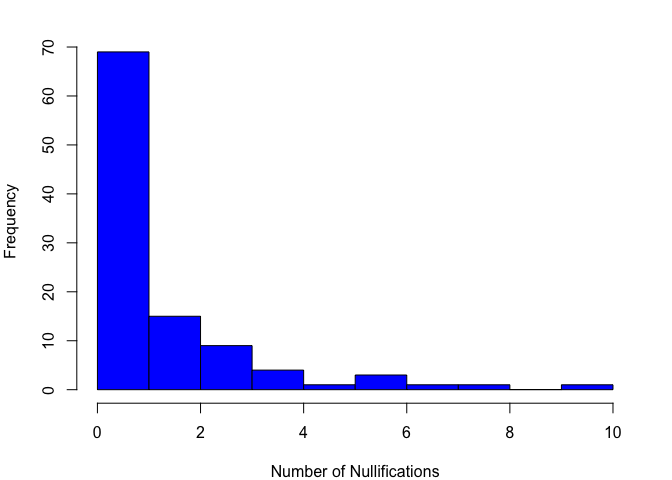
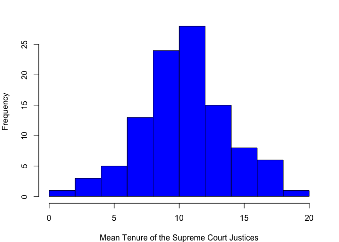
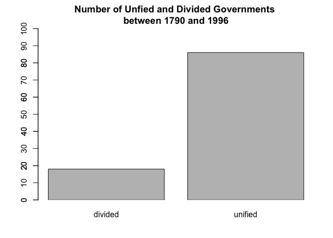
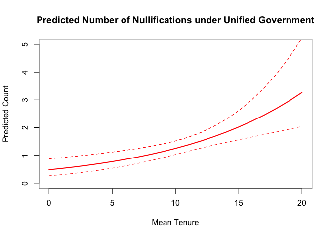
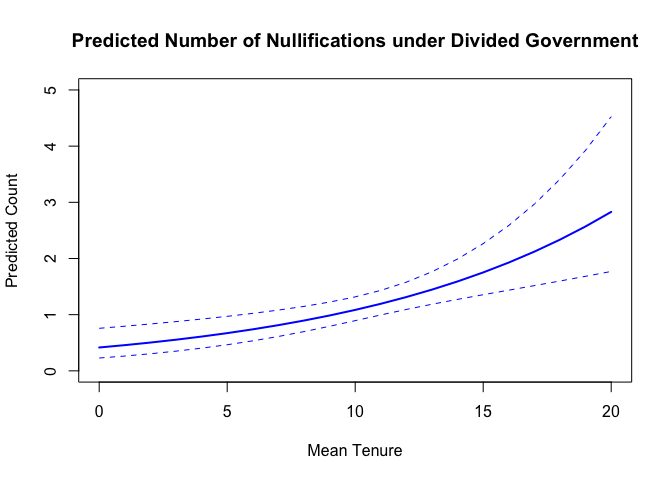
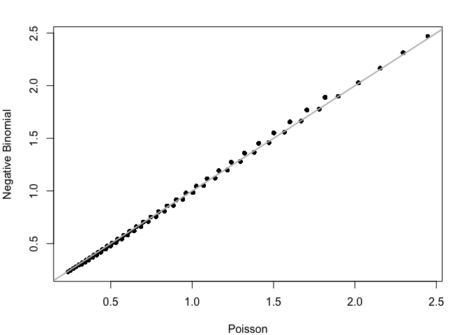

Count Models: Judicial Review Application
================
Constanza F. Schibber
2018-06-16

# Example: Judicial Review

- Y, number of acts of Congress overturned by the Supreme Court each
  Congress
- X, mean tenure of the Supreme Court justices
- X2, whether (1) or not (0) there was unified government

``` r
# Data
data_jr <- read.csv("nulls.csv")
head(data_jr)
```

    ##   congress nulls tenure unified year
    ## 1        1     0    0.8       1 1790
    ## 2        2     0    2.5       1 1792
    ## 3        3     0    4.2       0 1794
    ## 4        4     0    3.8       1 1796
    ## 5        5     0    4.0       1 1798
    ## 6        6     0    4.8       1 1800

## Descriptive Statistics

``` r
summary(data_jr)
```

    ##     congress          nulls            tenure         unified      
    ##  Min.   :  1.00   Min.   : 0.000   Min.   : 0.80   Min.   :0.0000  
    ##  1st Qu.: 26.75   1st Qu.: 0.000   1st Qu.: 8.50   1st Qu.:1.0000  
    ##  Median : 52.50   Median : 1.000   Median :10.55   Median :1.0000  
    ##  Mean   : 52.50   Mean   : 1.337   Mean   :10.40   Mean   :0.8269  
    ##  3rd Qu.: 78.25   3rd Qu.: 2.000   3rd Qu.:12.60   3rd Qu.:1.0000  
    ##  Max.   :104.00   Max.   :10.000   Max.   :18.40   Max.   :1.0000  
    ##       year     
    ##  Min.   :1790  
    ##  1st Qu.:1842  
    ##  Median :1893  
    ##  Mean   :1893  
    ##  3rd Qu.:1944  
    ##  Max.   :1996

``` r
par(mar=c(4,4,2,2))
hist(data_jr$nulls, main = "", xlab = "Number of Nullifications", col="blue")
```

<!-- -->

``` r
par(mar=c(4,4,2,2))
hist(data_jr$tenure, main = "", xlab = "Mean Tenure of the Supreme Court Justices", col="blue")
```

<!-- -->

``` r
par(mar=c(4,4,3,2))
plot(tenure~ year, type = 'l', lwd = 3, xlab = "Year", ylab = "Mean Tenure", main="Mean Tenure of the Supreme Court Justices \n over time", data = data_jr)
```

<!-- -->

``` r
par(mar=c(4,4,3,2))
barplot(table(as.factor(data_jr$unified)), xpd=FALSE, ylim = c(0,100), names.arg=c('divided', 'unified'), main = "Number of Unfied and Divided Governments \n between 1790 and 1996 ")
axis(2,at=seq(0,100,by=10))
```

<!-- -->

# Poission Regression

``` r
nulls.poisson<-glm(nulls ~ tenure + unified,
                                  family = "poisson",
                        data = data_jr)
summary(nulls.poisson)
```

    ## 
    ## Call:
    ## glm(formula = nulls ~ tenure + unified, family = "poisson", data = data_jr)
    ## 
    ## Deviance Residuals: 
    ##     Min       1Q   Median       3Q      Max  
    ## -2.3671  -1.5032  -0.6233   0.5607   4.1531  
    ## 
    ## Coefficients:
    ##             Estimate Std. Error z value Pr(>|z|)    
    ## (Intercept) -0.87762    0.37127  -2.364 0.018086 *  
    ## tenure       0.09589    0.02563   3.742 0.000183 ***
    ## unified      0.14350    0.23271   0.617 0.537472    
    ## ---
    ## Signif. codes:  0 '***' 0.001 '**' 0.01 '*' 0.05 '.' 0.1 ' ' 1
    ## 
    ## (Dispersion parameter for poisson family taken to be 1)
    ## 
    ##     Null deviance: 251.80  on 103  degrees of freedom
    ## Residual deviance: 237.52  on 101  degrees of freedom
    ## AIC: 385.08
    ## 
    ## Number of Fisher Scoring iterations: 6

# IRRs - Incidence Rate Ratios

``` r
library(mfx)
```

    ## Loading required package: sandwich

    ## Loading required package: lmtest

    ## Loading required package: zoo

    ## 
    ## Attaching package: 'zoo'

    ## The following objects are masked from 'package:base':
    ## 
    ##     as.Date, as.Date.numeric

    ## Loading required package: MASS

    ## Loading required package: betareg

``` r
nulls.poisson.IRR<-poissonirr(nulls ~ tenure + unified,
                   data = data_jr)
nulls.poisson.IRR
```

    ## Call:
    ## poissonirr(formula = nulls ~ tenure + unified, data = data_jr)
    ## 
    ## Incidence-Rate Ratio:
    ##              IRR Std. Err.      z     P>|z|    
    ## tenure  1.100634  0.028206 3.7416 0.0001828 ***
    ## unified 1.154307  0.268621 0.6166 0.5374716    
    ## ---
    ## Signif. codes:  0 '***' 0.001 '**' 0.01 '*' 0.05 '.' 0.1 ' ' 1

# Making Predictions for Poisson Models

Here we do some predicted counts. In another lab we will use Monte Carlo
simulations to calculate the predictions. Moreover, this model only has
two covariates but in models with more covariates you should use the
observed value approach which we will also cover later.

## Predictions for Unified Governments

``` r
# Unified Government
tenure<-seq(0,20,1)
unified<-1
simdata<-as.data.frame(cbind(tenure,unified))
nullhats<-predict(nulls.poisson, newdata = simdata, se.fit=TRUE)

# NOTE: These are XBs, not predicted counts.
# Transforming:

nullhats$Yhat<-exp(nullhats$fit)
nullhats$UB<-exp(nullhats$fit + 1.96*(nullhats$se.fit))
nullhats$LB<-exp(nullhats$fit - 1.96*(nullhats$se.fit))
```

# Predictions for Divided Government

``` r
# Divided Government
tenure<-seq(0,20,1)
unified<-0
simdata<-as.data.frame(cbind(tenure,unified))
nullhats.div<-predict(nulls.poisson,newdata=simdata,se.fit=TRUE)

# NOTE: These are XBs, not predicted counts.
# Transforming:

nullhats.div$Yhat<-exp(nullhats.div$fit)
nullhats.div$UB<-exp(nullhats.div$fit + 1.96*(nullhats$se.fit))
nullhats.div$LB<-exp(nullhats.div$fit - 1.96*(nullhats$se.fit))
```

# Plotting Predicted counts

``` r
plot(simdata$tenure, nullhats$Yhat, t="l", lwd=2, ylim=c(0,5),
     ylab = "Predicted Count", 
     xlab="Mean Tenure", 
     col='red', 
     main = "Predicted Number of Nullifications under Unified Government")
lines(simdata$tenure,nullhats$UB,lwd=1,lty=2, col='red')
lines(simdata$tenure,nullhats$LB,lwd=1,lty=2, col='red')
lines(simdata$tenure,nullhats$UB,lwd=1,lty=2, col='red')
```

<!-- -->

``` r
plot(simdata$tenure,nullhats.div$Yhat, t="l", lwd=2, ylim=c(0,5),
     ylab= "Predicted Count",  
     xlab="Mean Tenure", 
    col='blue', 
    main = "Predicted Number of Nullifications under Divided Government")
lines(simdata$tenure,nullhats.div$UB,lwd=1,lty=2, col='blue')
lines(simdata$tenure,nullhats.div$LB,lwd=1,lty=2, col='blue')
```

<!-- -->

**Can you calculate difference in counts along with a confidence
interval for the difference? Try it!**

# Overdisperson in Count Models

The data comprises Amici Curiae filed in the Supreme Court.

- Y, number of amici curiae filed
- term, court term
- civlib, whether a case involved civil liberties (1) or not (0)

``` r
amici<-read.csv("Amici.csv", header=TRUE)

summary(amici)
```

    ##      namici            term          civlibs      
    ##  Min.   : 0.000   Min.   :53.00   Min.   :0.0000  
    ##  1st Qu.: 0.000   1st Qu.:64.00   1st Qu.:0.0000  
    ##  Median : 0.000   Median :72.00   Median :1.0000  
    ##  Mean   : 1.026   Mean   :71.12   Mean   :0.5012  
    ##  3rd Qu.: 1.000   3rd Qu.:79.00   3rd Qu.:1.0000  
    ##  Max.   :53.000   Max.   :85.00   Max.   :1.0000

## Poisson

``` r
# Poisson Regression

amici.poisson<-glm(namici~term+civlibs,data=amici,
                   family="poisson")
summary(amici.poisson)
```

    ## 
    ## Call:
    ## glm(formula = namici ~ term + civlibs, family = "poisson", data = amici)
    ## 
    ## Deviance Residuals: 
    ##    Min      1Q  Median      3Q     Max  
    ## -2.212  -1.432  -1.031   0.101  17.541  
    ## 
    ## Coefficients:
    ##             Estimate Std. Error z value Pr(>|z|)    
    ## (Intercept) -4.51196    0.11190  -40.32   <2e-16 ***
    ## term         0.06361    0.00147   43.27   <2e-16 ***
    ## civlibs     -0.29797    0.02350  -12.68   <2e-16 ***
    ## ---
    ## Signif. codes:  0 '***' 0.001 '**' 0.01 '*' 0.05 '.' 0.1 ' ' 1
    ## 
    ## (Dispersion parameter for poisson family taken to be 1)
    ## 
    ##     Null deviance: 22875  on 7156  degrees of freedom
    ## Residual deviance: 20675  on 7154  degrees of freedom
    ## AIC: 26862
    ## 
    ## Number of Fisher Scoring iterations: 6

## Is there Overdispersion?

Overdispersion occurs when the observed variance is higher than the
variance of a theoretical model. For Poisson models, variance increases
with the mean and, therefore, variance usually (roughly) equals the mean
value. If the variance is much higher, the data are “overdispersed”.

We can calculate our own overdisperson chi-square test:

``` r
Phats<-fitted.values(amici.poisson)
# overdispertion ration
z<-(amici$namici-Phats) / sqrt(Phats)
sum_z_2 = sum(z^2)
sum_z_2
```

    ## [1] 38320.4

``` r
# p-value for overdispertion test
pchisq(sum_z_2, 7154, lower.tail = FALSE)
```

    ## [1] 0

We can also use a canned function which provides the same results:

``` r
library(performance)
check_overdispersion(amici.poisson)
```

    ## # Overdispersion test
    ## 
    ##        dispersion ratio =     5.357
    ##   Pearson's Chi-Squared = 38320.404
    ##                 p-value =   < 0.001

    ## Overdispersion detected.

## Negative Binomial

``` r
# Negative Binomial
library(MASS)
amici.NB<-glm.nb(namici~term+civlibs,data=amici)
summary(amici.NB)
```

    ## 
    ## Call:
    ## glm.nb(formula = namici ~ term + civlibs, data = amici, init.theta = 0.256657474, 
    ##     link = log)
    ## 
    ## Deviance Residuals: 
    ##     Min       1Q   Median       3Q      Max  
    ## -1.1013  -0.9131  -0.7494   0.0396   4.4204  
    ## 
    ## Coefficients:
    ##              Estimate Std. Error z value Pr(>|z|)    
    ## (Intercept) -4.683137   0.220582 -21.231  < 2e-16 ***
    ## term         0.065731   0.003043  21.602  < 2e-16 ***
    ## civlibs     -0.267769   0.054032  -4.956 7.21e-07 ***
    ## ---
    ## Signif. codes:  0 '***' 0.001 '**' 0.01 '*' 0.05 '.' 0.1 ' ' 1
    ## 
    ## (Dispersion parameter for Negative Binomial(0.2567) family taken to be 1)
    ## 
    ##     Null deviance: 5442  on 7156  degrees of freedom
    ## Residual deviance: 4968  on 7154  degrees of freedom
    ## AIC: 17378
    ## 
    ## Number of Fisher Scoring iterations: 1
    ## 
    ## 
    ##               Theta:  0.25666 
    ##           Std. Err.:  0.00838 
    ## 
    ##  2 x log-likelihood:  -17370.16800

``` r
1 / amici.NB$theta
```

    ## [1] 3.896243

## Compare Fitted Values from Poisson against Negative Binomial

``` r
par(mar=c(4,4,2,2))
plot(amici.poisson$fitted.values,amici.NB$fitted.values,pch=20,
     xlab="Poisson",ylab="Negative Binomial",main="")
abline(a=0, b=1,lwd=2, col='gray')
```

<!-- -->
