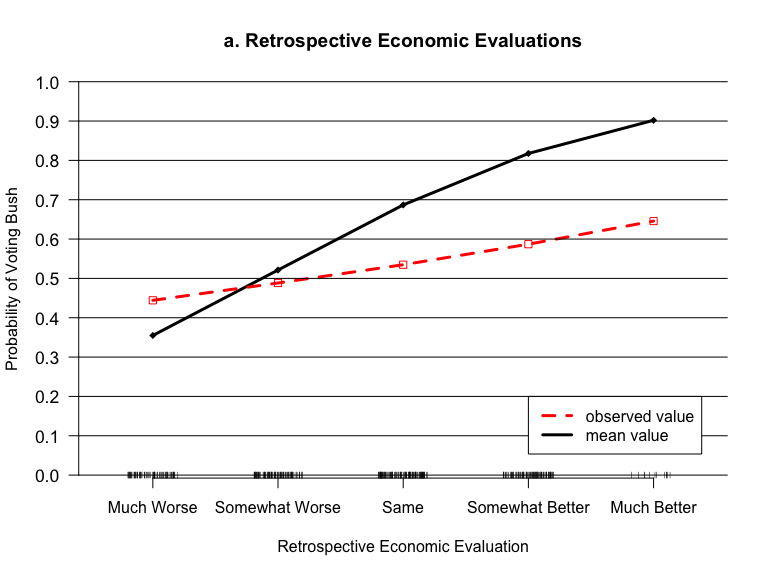
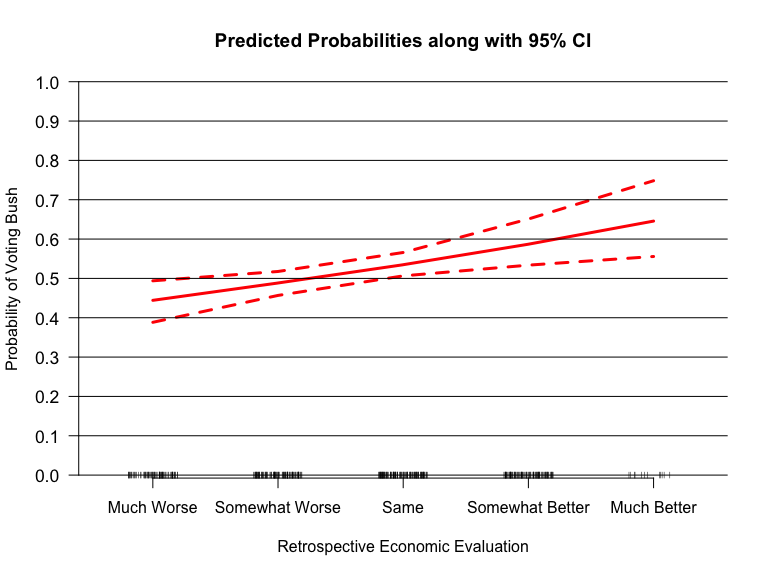
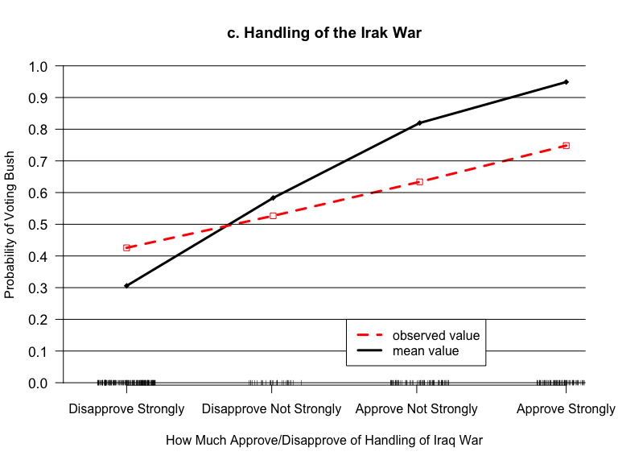

Predicted Probabilities using MC Simulations and Observed Value Approach
================
Constanza F. Schibber
2016-04-16

- [1 Data and Probit Model](#1-data-and-probit-model)
- [2 Monte Carlo Simulation of Coefficient
  Estimates](#2-monte-carlo-simulation-of-coefficient-estimates)
- [3 Observed Value Approach](#3-observed-value-approach)
  - [3.1 Retrospective Voting](#31-retrospective-voting)
  - [3.2 Party ID](#32-party-id)
  - [3.3 Handling of the Irak war](#33-handling-of-the-irak-war)

Replication of:

Behind the Curve: Clarifying the Best Approach to Calculating Predicted
Probabilities and Marginal Effects from Limited Dependent Variable
Models Michael J. Hanmer, Kerem Ozan Kalkan

The original documents from the publication provide STATA code for
replication. I replicate their work in `R`.

# 1 Data and Probit Model

``` r
library(foreign)
library(arm)
```

    ## Loading required package: MASS

    ## Loading required package: Matrix

    ## Loading required package: lme4

    ## 
    ## arm (Version 1.13-1, built: 2022-8-25)

    ## Working directory is /Users/connie/Generalized-Linear-Models/Labs/10.week

``` r
library(stargazer)
```

    ## 
    ## Please cite as:

    ##  Hlavac, Marek (2022). stargazer: Well-Formatted Regression and Summary Statistics Tables.

    ##  R package version 5.2.3. https://CRAN.R-project.org/package=stargazer

``` r
# Dat and Model
NES <- read.dta("Hanmer Kalkan AJPS NES example.dta")

NES <- subset(NES, presvote != "NA")

fit <- glm(presvote ~ retecon + partyid + bushiraq + as.numeric(ideol7b) +
    white + female + age + educ1_7 + income, data = NES, family = binomial(link = probit))

stargazer(fit, type = "text", covariate.labels = c("Retrospective Voting",
    "party ID", "Irak War", "Ideology", "White", "Female", "Age",
    "Education", "Income"))
```

    ## 
    ## ================================================
    ##                          Dependent variable:    
    ##                      ---------------------------
    ##                               presvote          
    ## ------------------------------------------------
    ## Retrospective Voting          0.871***          
    ##                                (0.275)          
    ##                                                 
    ## party ID                      0.583***          
    ##                                (0.088)          
    ##                                                 
    ## Irak War                      2.130***          
    ##                                (0.371)          
    ##                                                 
    ## Ideology                        0.181           
    ##                                (0.130)          
    ##                                                 
    ## White                           0.091           
    ##                                (0.306)          
    ##                                                 
    ## Female                         -0.081           
    ##                                (0.258)          
    ##                                                 
    ## Age                            -0.004           
    ##                                (0.008)          
    ##                                                 
    ## Education                      -0.076           
    ##                                (0.100)          
    ##                                                 
    ## Income                          0.014           
    ##                                (0.027)          
    ##                                                 
    ## Constant                      -2.611***         
    ##                                (0.864)          
    ##                                                 
    ## ------------------------------------------------
    ## Observations                     383            
    ## Log Likelihood                 -60.414          
    ## Akaike Inf. Crit.              140.827          
    ## ================================================
    ## Note:                *p<0.1; **p<0.05; ***p<0.01

# 2 Monte Carlo Simulation of Coefficient Estimates

``` r
n.draws <- 1000

NES.sim <- coef(sim(fit, n.draws))
```

# 3 Observed Value Approach

## 3.1 Retrospective Voting

The following reproduces Figure 1 - Panel a.

We first calculate predicted probabilities setting covariates to their
mean or median value in order to compare these predictions to the ones
in which we set covariates to their observed value (in the data) and
average over them.

``` r
######################################## Retrospective
######################################## Voting Figure 1 -
######################################## Panel a Average
######################################## Value Approach
retrosecon <- seq(-1, 1, length.out = 5)

x.retro.m <- data.frame(intercept = 1, retecon = retrosecon,
    partyid = mean(NES$partyid), bushiraq = mean(NES$bushiraq),
    ideol7b = mean(as.numeric(NES$ideol7b)), white = mean(NES$white),
    female = mean(NES$female), age = mean(NES$age), educ1_7 = mean(NES$educ1_7),
    income = mean(NES$income))

# use this because of data frame, otherwise matrix
# multiplication doesn't work
x.retro.m <- data.matrix(x.retro.m)

pp.sim <- pnorm(x.retro.m %*% t(NES.sim))

pe.ac <- apply(pp.sim, 1, mean)
lo.ac <- apply(pp.sim, 1, quantile, prob = 0.025)
hi.ac <- apply(pp.sim, 1, quantile, prob = 0.975)


######################################### Observed Value
######################################### Expected
######################################### Probabilities
retrosecon <- seq(-1, 1, length.out = 5)

# Empty vectors to store the point estimates and confidence
# intervals
pe.ov <- as.matrix(NA, nrow = length(retrosecon))
lo.ov <- as.matrix(NA, nrow = length(retrosecon))
hi.ov <- as.matrix(NA, nrow = length(retrosecon))


for (j in 1:length(retrosecon)) {
    # Loop goes across retroecon values

    # Set the other independent variables to all of their
    # observed values
    x.retro <- data.frame(intercept = 1, retecon = retrosecon[j],
        partyid = NES$partyid, bushiraq = NES$bushiraq, ideol7b = NES$ideol7b,
        white = NES$white, female = NES$female, age = NES$age,
        educ1_7 = NES$educ1_7, income = NES$income)
    x.retro <- data.matrix(x.retro)

    # Save average of predicted probabilities across all
    # the observations
    pp <- matrix(NA, nrow = n.draws)

    for (k in 1:n.draws) {
        # Loop over coefficients

        xb <- pnorm(x.retro %*% NES.sim[k, ])
        pp[k] <- mean(xb)

    }

    # Compute point estimate and CI for each value of
    # retrospective econ
    pe.ov[j] <- mean(pp)
    lo.ov[j] <- quantile(pp, 0.025)  # CIs on the probability scale
    hi.ov[j] <- quantile(pp, 0.975)

}
```

The following plot replicates Figure 1 (panel a) from the article. You
can see the difference in the predictions between setting covariates at
their mean/median compared to setting them at their observed value.

``` r
# Plot
plot(retrosecon, pe.ac, type = "l", ylim = c(0.03, 0.97), ylab = "Probability of Voting Bush",
    xlab = "Retrospective Economic Evaluation", main = "a. Retrospective Economic Evaluations",
    lwd = 3, axes = FALSE, xlim = c(-1.2, 1.2))
lines(retrosecon, pe.ov, col = "red", lty = 2, lwd = 3)
points(retrosecon, pe.ac, pch = 18)
points(retrosecon, pe.ov, pch = 0, col = "red")
for (i in 0:10) {
    n = i/10
    abline(h = n)
}
axis(2, at = seq(0, 1, 0.1), las = 2, cex.axis = 1.1)
axis(1, at = c(-1, -0.5, 0, 0.5, 1), labels = c("Much Worse",
    "Somewhat Worse", "Same", "Somewhat Better", "Much Better"))
legend(0.5, 0.2, legend = c("observed value", "mean value"),
    lty = 2:1, lwd = 3, col = c("red", "black"))
rug(jitter(NES$retecon), ticksize = 0.015)
```



Below, I plot the predicted probabilities calcuated by using the
observed value approach along with CI.

``` r
# Plot
plot(retrosecon, pe.ov, type = "l", ylim = c(0.03, 0.97), ylab = "Probability of Voting Bush",
    xlab = "Retrospective Economic Evaluation", main = "Predicted Probabilities along with 95% CI",
    lwd = 3, axes = FALSE, xlim = c(-1.2, 1.2), col = "red")
lines(retrosecon, lo.ov, lwd = 3, lty = 2, col = "red")
lines(retrosecon, hi.ov, lwd = 3, lty = 2, col = "red")
for (i in 0:10) {
    n = i/10
    abline(h = n)
}
axis(2, at = seq(0, 1, 0.1), las = 2, cex.axis = 1.1)
axis(1, at = c(-1, -0.5, 0, 0.5, 1), labels = c("Much Worse",
    "Somewhat Worse", "Same", "Somewhat Better", "Much Better"))
rug(jitter(NES$retecon), ticksize = 0.015)
```



## 3.2 Party ID

The following reproduces Figure 1 - Panel b.

``` r
partyid <- seq(0, 6, length.out = 7)

x.partyid.m <- data.frame(intercept = 1, retecon = mean(NES$retecon),
    partyid = partyid, bushiraq = mean(NES$bushiraq), ideol7b = mean(as.numeric(NES$ideol7b)),
    white = mean(NES$white), female = mean(NES$female), age = mean(NES$age),
    educ1_7 = mean(NES$educ1_7), income = mean(NES$income))
x.partyid.m <- data.matrix(x.partyid.m)


pp.sim <- pnorm(x.partyid.m %*% t(NES.sim))

pe.ac <- apply(pp.sim, 1, quantile, 0.5)
lo.ac <- apply(pp.sim, 1, quantile, 0.025)
hi.ac <- apply(pp.sim, 1, quantile, 0.975)


######################################### Observed Value
######################################### Expected
######################################### Probabilities

# Empty vectors to store the point estimates and confidence
# intervals
pe.ov <- as.matrix(NA, nrow = length(partyid))
lo.ov <- as.matrix(NA, nrow = length(partyid))
hi.ov <- as.matrix(NA, nrow = length(partyid))


for (j in 1:length(partyid)) {
    # Loop goes across partyid values

    # Set the other independent variables to all of their
    # observed values
    x.partyid <- data.frame(intercept = 1, retecon = NES$retecon,
        partyid = partyid[j], bushiraq = NES$bushiraq, ideol7b = NES$ideol7b,
        white = NES$white, female = NES$female, age = NES$age,
        educ1_7 = NES$educ1_7, income = NES$income)
    x.partyid <- data.matrix(x.partyid)

    # Save average of linear predictor across all the
    # observations
    pp <- matrix(NA, nrow = n.draws)

    for (k in 1:n.draws) {
        # Loop over coefficients

        # For each observation in the dataset

        xb <- pnorm(x.partyid %*% NES.sim[k, ])
        # Compute the mean value across all the
        # observations
        pp[k] <- mean(xb)

    }
    # Compute point estimate and CI for each value of
    # partyid
    pe.ov[j] <- quantile(pp, 0.5)
    lo.ov[j] <- quantile(pp, 0.025)
    hi.ov[j] <- quantile(pp, 0.975)
}
```

``` r
# Plot
plot(partyid, pe.ac, type = "l", ylim = c(0.03, 0.97), ylab = "Probability of Voting Bush",
    xlab = "Party Identification", main = "b. Party Identification",
    lwd = 3, axes = FALSE, xlim = c(0, 6))
lines(partyid, pe.ov, col = "red", lty = 2, lwd = 3)
points(partyid, pe.ac, pch = 18)
points(partyid, pe.ov, pch = 0, col = "red")
for (i in 0:10) {
    n = i/10
    abline(h = n)
}
axis(2, at = seq(0, 1, 0.1), las = 2, cex.axis = 1.1)
axis(1, at = c(0, 1, 2, 3, 4, 5, 6), labels = c("SD", "WD", "ID",
    "I", "IR", "WR", "SR"))
legend(0.5, 0.2, legend = c("observed value", "mean value"),
    lty = 2:1, lwd = 3, col = c("red", "black"))
rug(jitter(NES$partyid), ticksize = 0.015)
```


## 3.3 Handling of the Irak war

The following reproduces Figure 1 - Panel c.

``` r
######################################## Handling of the
######################################## Irak war Figure 1
######################################## - Panel c Average
######################################## Value Approach
irak <- seq(0, 1, length.out = 4)

x.irak.m <- data.frame(intercept = 1, retecon = mean(NES$retecon),
    partyid = mean(NES$partyid), bushiraq = irak, ideol7b = mean(as.numeric(NES$ideol7b)),
    white = mean(NES$white), female = mean(NES$female), age = mean(NES$age),
    educ1_7 = mean(NES$educ1_7), income = mean(NES$income))
x.irak.m <- data.matrix(x.irak.m)  # use this because of data frame, otherwise matrix multiplication doesn't work

pp.sim <- pnorm(x.irak.m %*% t(NES.sim))

pe.ac <- apply(pp.sim, 1, quantile, prob = 0.5)
lo.ac <- apply(pp.sim, 1, quantile, prob = 0.025)
hi.ac <- apply(pp.sim, 1, quantile, prob = 0.975)


######################################### Observed Value
######################################### Expected
######################################### Probabilities

# Empty vectors to store the point estimates and confidence
# intervals
pe.ov <- as.matrix(NA, nrow = length(irak))
lo.ov <- as.matrix(NA, nrow = length(irak))
hi.ov <- as.matrix(NA, nrow = length(irak))


for (j in 1:length(irak)) {
    # Loop goes across retroecon values

    # Set the other independent variables to all of their
    # observed values
    x.irak <- data.frame(intercept = 1, retecon = NES$retecon,
        partyid = NES$partyid, bushiraq = irak[j], ideol7b = NES$ideol7b,
        white = NES$white, female = NES$female, age = NES$age,
        educ1_7 = NES$educ1_7, income = NES$income)
    x.irak <- data.matrix(x.irak)

    # Save average of predicted probabilities across all
    # the observations
    pp <- matrix(NA, nrow = n.draws)

    for (k in 1:n.draws) {
        # Loop over coefficients

        xb <- pnorm(x.irak %*% NES.sim[k, ])
        pp[k] <- mean(xb)

    }

    # Compute point estimate and CI for each value of
    # retrospective econ
    pe.ov[j] <- quantile(pp, 0.5)
    lo.ov[j] <- quantile(pp, 0.025)  # CIs on the probability scale
    hi.ov[j] <- quantile(pp, 0.975)

}
```

``` r
# Plot
plot(irak, pe.ac, type = "l", ylim = c(0.03, 0.97), ylab = "Probability of Voting Bush",
    xlab = "How Much Approve/Disapprove of Handling of Iraq War",
    main = "c. Handling of the Irak War", lwd = 3, axes = FALSE,
    xlim = c(-0.1, 1))
lines(irak, pe.ov, col = "red", lty = 2, lwd = 3)
points(irak, pe.ac, pch = 18)
points(irak, pe.ov, pch = 0, col = "red")
for (i in 0:10) {
    n = i/10
    abline(h = n)
}
axis(2, at = seq(0, 1, 0.1), las = 2, cex.axis = 1.1)
axis(1, at = c(0, 0.33, 0.66, 1), labels = c("Disapprove Strongly",
    "Disapprove Not Strongly", "Approve Not Strongly", "Approve Strongly"))
legend(0.5, 0.2, legend = c("observed value", "mean value"),
    lty = 2:1, lwd = 3, col = c("red", "black"))
rug(jitter(NES$bushiraq), ticksize = 0.015)
```

    ## Warning in rug(jitter(NES$bushiraq), ticksize = 0.015): some values will be
    ## clipped



**Class Exercise:** Reproduce panel (d) form the paper.
